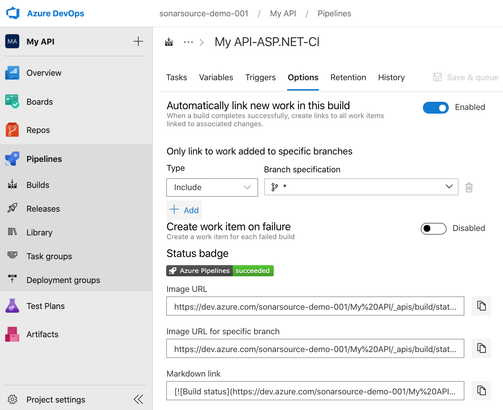
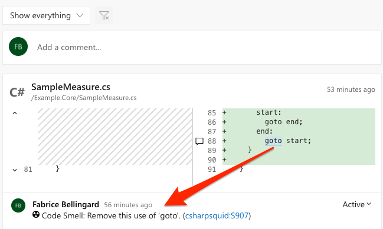

**[SonarQube™][sq]** is the leading tool for continuously inspecting the Code Quality and Security™ of your codebases, all while empowering development teams. Covering 25+ programming languages including C#, VB.Net, JavaScript, TypeScript and C++; SonarQube easily pairs up with your Azure DevOps environment and tracks down bugs, security vulnerabilities and code smells. With over 170,000 deployments helping small development teams as well as global organizations, SonarQube provides the means for all teams and companies around the world to own and impact their Code Quality and Security.

This extension provides tasks that you incorporate into your build definition(s) to enable additional SonarQube functionality in Azure DevOps environments. When paired with SonarQube Community Edition, you'll spot issues in your master codebase. SonarQube Commercial Editions offer additional functionality with Branch and Pull Request analysis so your team spots and resolves code issues before merging to master. Analysis results are published right in your Pull Requests! 

_Note: this extension is officially supported for use with Azure DevOps Server (formerly TFS). Ongoing interoperability with Azure DevOps Services (cloud-based) is not assured._

## Benefits of the SonarQube Azure DevOps Marketplace Extension

### Quality Gate™ Status Publishing
A Quality Gate is a Pass/Fail status indicator that clearly lets you know if your code is clean and safe. SonarQube comes with a default Quality Gate called Sonar Way™ that's built-in and ready to use. When you see a 'Green' Quality Gate, you know that your application is releasable and your team is hitting the mark! The Quality Gate provides the ability to know at each analysis whether an application passes or fails the release criteria. In other words, it tells you at every analysis whether an application is ready for production "quality-wise".

Example of a passing Quality Gate:

Example of a failing Quality Gate:

### Automatically Analyze Branches and Decorate Pull Requests (SonarQube Commercial Editions)
This extension allows automatic analysis of all branches and pull-requests which enables early discovery of bugs and security vulnerabilities prior to a merge. Branches and PRs get their own Quality Gate status and analysis results are pushed to the relevant project branch in SonarQube. 

It's easy to add non-disruptive code quality checks right into your Azure DevOps workflow. Simply add SonarQube to your build pipeline definition and you're on your way to only promoting quality code. SonarQube analyzes the code changes and decorates Pull Requests with comments and overall status -> _merge with confidence!_

When a build is run on a PR, the extension automatically publishes the QG status and configures the analysis to be pushed to the relevant project branch on SonarQube.

**Important note**: to activate Pull Request decoration, you must specify a user token in the "General Settings > Pull Requests" administration page of your project in SonarQube.

## Additional Highlights
### Seamless integration with .NET solutions
C# and VB.NET analysis is simple and straightforward and only requires adding the **Prepare Analysis Configuration** and **Run Code Analysis** tasks to your build definition.

### Easy setup for Maven and Gradle projects
For Java, analyzing your source code is also very easy. It only requires adding the **Prepare Analysis Configuration** task and checking the **Run SonarQube Analysis** option in the 'Code Analysis' panel in your Maven or Gradle task.

## SonarQube Azure DevOps Marketplace Extension Details
This extension provides Branch and Pull Request analysis along with:
* A dedicated **SonarQube EndPoint** that defines the SonarQube server to be used.
* Three build tasks to get your projects analyzed easily:
  * **Prepare Analysis Configuration:** Configures all the required settings prior to executing a build. This task is mandatory. For .NET solutions or Java projects, this task helps SonarQube seamlessly integrate with MSBuild, Maven and Gradle tasks.
  * **Run Code Analysis:** Executes the source code analysis. This task isn't required for Maven or Gradle projects.
  * **Publish Quality Gate Result:** Displays the Quality Gate status in the build summary. This tasks is optional, as it may increase the overall build time.

This [Get Started][getstarted] guide provides instructions on installing, configuring and using the SonarQube extension for Azure DevOps.

   [sq]: <https://www.sonarqube.org/>
   [getstarted]: <http://redirect.sonarsource.com/doc/install-configure-scanner-tfs-ts.html>
