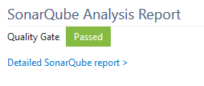

**[SonarQube][sq]** is the leading product for Continuous Code Quality. It is an open source, static source code analysis solution that enables continuous tracking of bugs, code smells and vulnerabilities for more than 20 different languages such as C#, VB .Net, Java, C, C++, COBOL, JavaScript, ...

SonarQube can be [installed][getstarted] and run on a dedicated infrastructure.

The analysis of the source code doesn't happen on the server side, but must be part of the build chain to make the analysis as accurate as possible. These analyses are performed using scanners.

## About the SonarQube VSTS Marketplace Extension
This extension provides the following features:
* A dedicated **SonarQube EndPoint** to define the SonarQube server to be used.
* Three build tasks to get your projects analyzed easily:
  * **Prepare Analysis Configuration** task, to configure all the required settings before executing the build. This task is mandatory. In case of .NET solutions or Java projects, this tasks helps to integrate seamlessly with MSBuild, Maven and Gradle tasks.
  * **Run Code Analysis** task, to actually execute the analysis of the source code. Not required for Maven or Gradle projects.
  * **Publish Analysis Result** task, to display the quality gate status in the build summary. This tasks is optional, as it can increase the overall build time.

## Highlighted Features
### Seamless Integration with .Net solutions
The analysis of C# and VB. Net solution is really straightforward since it only requires adding the two **Prepare Analysis Configuration** and **Run Code Analysis** tasks to your build definition.

### Easy setup for Maven and Gradle projects
If you're doing Java, analyzing your source code is also very easy. It only requires adding the **Prepare Analysis Configuration** task, and check the **Run SonarQube Analysis** option in the "Code Analysis" panel of the Maven or Gradle task.

### Quality Gate Status
The **Publish Analysis Result** task waits for the analysis report to be consumed by the SonarQube in order to flag the build job with the Quality Gate status. The Quality Gate is a major, out-of-the-box, feature of SonarQube. It provides the ability to know at each analysis whether an application passes or fails the release criteria. In other words it tells you at every analysis whether an application is ready for production "quality-wise".

Example of a passing Quality Gate:

Example of a failing Quality Gate:

This [Get Started][getstarted] guide provides all the required documentation for you to setup a build definition.

   [sq]: <https://www.sonarsource.com/products/sonarqube/>
   [getstarted]: <http://redirect.sonarsource.com/doc/install-configure-scanner-tfs-ts.html>
