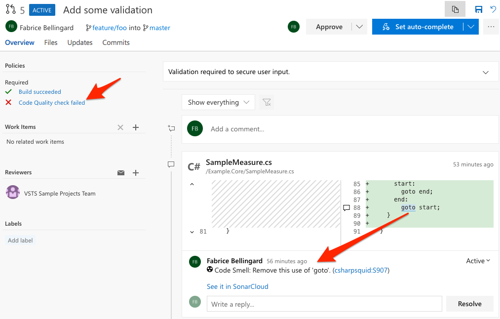
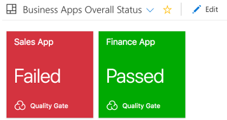

**[SonarQube Cloud][sc]** is a SaaS code analysis tool, designed to detect coding issues in 30+ languages, frameworks, and IaC platforms. The solution also provides fix recommendations leveraging AI with Sonar’s AI CodeFix capability. By integrating directly with your CI pipeline or one of the supported DevOps platforms, your code is checked against an extensive set of rules that cover many attributes of code, such as maintainability, reliability, and security issues, on each merge/pull request.

_(Formerly SonarCloud)_

You can start a no-commitment, 14-day trial of SonarQube Cloud for your private repositories completely free. No need to speak with a sales rep or request a license key - get automatic code analysis results on your private projects in minutes! SonarQube Cloud analysis is always free for open-source projects. You can create your free SonarQube Cloud account [here][signup].

This Azure DevOps extension provides build tasks that you can add in your build definition. You'll benefit from automated detection of bugs and vulnerabilities across all branches and Pull Requests. SonarQube Cloud explains all coding issues in details, giving you chance to fix your code before even merging and deploying, all the while learning best practices along the way. At project level, you'll also get a dedicated widget that tracks the overall health of your application.

To get started in a few minutes, you can:

- Follow this dedicated [Microsoft Lab][getstarted]
- Follow the SonarQube Cloud walkthrough in this Microsoft Learning Module: [Scan code for vulnerabilities in Azure Pipelines][msft_learn].
- Benefit from embedded templates for common analyses:
  - **Classic** build pipelines templates integrated while creating a new pipeline
  - **YAML** build pipeline templates available in our Sourcecode: https://github.com/SonarSource/sonar-scanner-azdo/tree/master/yaml-pipeline-templates
- Benefit from a bunch of sample projects (using different build technologies), analyzed on SonarQube Cloud, with their **YAML** pipelines files (See the SonarQube Cloud badge on the README.md file for a link to SonarQube Cloud project)
  - [.NET Framework](https://dev.azure.com/sonarsource/DotNetTeam%20Project/_git/sample-dotnet-framework-project)
  - [.NET Core](https://dev.azure.com/sonarsource/DotNetTeam%20Project/_git/sample-dotnet-core-project)
  - [C++](https://dev.azure.com/sonarsource/DotNetTeam%20Project/_git/sample-cpp-project)
  - [Gradle](https://dev.azure.com/sonarsource/DotNetTeam%20Project/_git/sample-gradle-project)
  - [Maven](https://dev.azure.com/sonarsource/DotNetTeam%20Project/_git/sample-maven-project)
  - [Node.js](https://dev.azure.com/sonarsource/DotNetTeam%20Project/_git/sample-nodejs-project)
- Get IDE Support with SonarLint integration to find code issues on the fly. SonarQube Cloud rules and analysis settings synchronize to SonarLint, aligning teams around a single standard of Clean Code
- Get a free analysis for open-source projects
- **Start a no-commitment, free 14-day trial for your private repositories**

## About the SonarQube Cloud Azure DevOps Marketplace Extension

This extension provides the following features:

- A dedicated **SonarQube Cloud EndPoint** to set the user token and validate the connection.
- Three build tasks (along with build templates) to get your projects analyzed easily:
  - **Prepare Analysis Configuration** task, to configure all the required settings before executing the build. This task is mandatory. In case of .NET solutions or Java projects, this tasks helps to integrate seamlessly with MSBuild, Maven and Gradle tasks.
  - **Run Code Analysis** task, to actually execute the analysis of the source code. Not required for Maven or Gradle projects.
  - **Publish Quality Gate Result** task, to display the quality gate status in the build summary. This task is optional, as it can increase the overall build time.
- Analysis of the branches and the **pull requests** of your projects
- A **widget** to monitor the quality gate for your projects on your favorite dashboard
- A **deployment gate (in preview)** allowing you to control your deployment process by checking the status of the Quality Gate of the last build related to the release pipeline executed.

Note that the above features are **available for all Git repository providers in Azure DevOps**: Azure Repos Git, Bitbucket Cloud or GitHub.

Want to see more examples of SonarQube Cloud in action? You can [explore current Open Source projects in SonarQube Cloud][opensource] that are using the Clean as You Code methodology.

## Highlighted Features

### Seamless Integration with .Net solutions

The analysis of C# and VB. Net solution is really straightforward since it only requires adding the two **Prepare Analysis Configuration** and **Run Code Analysis** tasks to your build definition.

### Easy setup for Maven and Gradle projects

If you're doing Java, analyzing your source code is also very easy. It only requires adding the **Prepare Analysis Configuration** task, and check the **Run SonarQube (Server, Cloud) Analysis** option in the "Code Analysis" panel of the Maven or Gradle task.

### Branch and Pull Request analysis

Whatever type of source repository you are analysing, when a build is run on a branch of your project, the extension automatically configures the analysis to be pushed to the relevant project branch on SonarQube Cloud:

If you configure your build definition as a build validation for pull requests of that project (this can be done on "Branch policies"), SonarQube Cloud will also analyze the code changes and decorate the pull request with comments and overall status so that you can merge with confidence:

**Important note**: to activate pull request decoration, you must specify a user token in the "General Settings > Pull Requests" administration page of your project in SonarQube Cloud.

### Quality Gate Status

#### In a dashboard widget

You can monitor the quality gate status of your projects in your favorite dashboard:

#### In Release Pipelines (Preview)

You can check the quality gate status of a build as a pre-deployment gate in release pipelines.

#### In the build summary

The **Publish Quality Gate Result** task waits for the analysis report to be consumed by SonarQube Cloud in order to flag the build job with the Quality Gate status. The Quality Gate is a major, out-of-the-box feature of SonarQube Cloud. It provides the ability to know at each analysis whether an application passes or fails the release criteria. In other words it tells you at every analysis whether an application is ready for production "quality-wise".

Example of a passing Quality Gate:

Example of a failing Quality Gate:

Learn More - [SonarQube Cloud | Azure integration][learnmore]

[sc]: https://www.sonarsource.com/products/sonarcloud/?utm_medium=referral&utm_source=azure&utm_campaign=sc-product&utm_content=signup-sonarcloud-listing-x-x&utm_term=ww-psp-x
[signup]: https://www.sonarsource.com/products/sonarcloud/signup/?utm_medium=referral&utm_source=azure&utm_campaign=sc-signup&utm_content=signup-sonarcloud-listing-x-x&utm_term=ww-psp-x
[opensource]: https://sonarcloud.io/explore/projects?sort=-analysis_date?utm_medium=referral&utm_source=azure&utm_campaign=sc-signup&utm_content=signup-sonarcloud-listing-x-x&utm_term=ww-psp-x
[getstarted]: https://www.azuredevopslabs.com/labs/vstsextend/sonarcloud/
[learnmore]: https://www.sonarsource.com/products/sonarcloud/features/integrations/azure-integration-2/?utm_medium=referral&utm_source=azure&utm_campaign=sc-signup&utm_content=signup-sonarcloud-listing-x-x&utm_term=ww-psp-x
