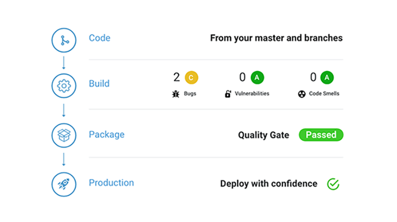
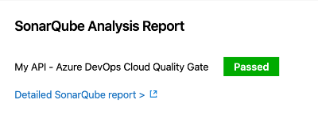
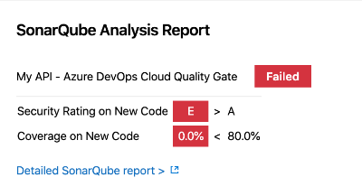
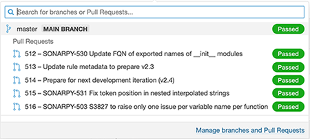
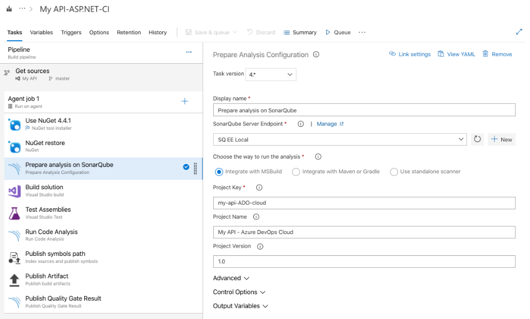
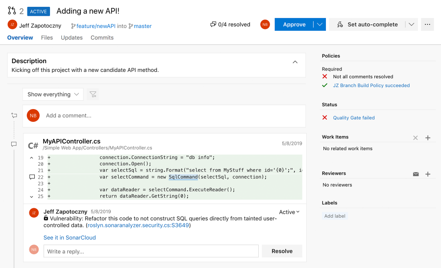

**[SonarQube Server][SQS]** is an on-premise analysis tool designed to detect quality and security issues in 30+ languages, frameworks, and IaC platforms. The solution also provides fix recommendations leveraging AI with Sonar’s AI CodeFix capability. By integrating directly with your CI pipeline or on one of the supported DevOps platforms, your code is checked against an extensive set of rules that cover many attributes of code, such as maintainability, reliability, and security issues on each merge/pull request.

_(Formerly SonarQube)_

This extension provides tasks that you incorporate into your build definition(s) to enable additional SonarQube Server functionality in Azure DevOps environments. When paired with SonarQube [Community Build][CB], you can analyze and see the results for scanning your master codebase. SonarQube [Commercial Editions][CE] offer additional functionality with Branch and Pull Request analysis so your team spots and resolves code issues before merging to master. Analysis results are published right in your Pull Requests!

## Benefits of the SonarQube Server Azure DevOps Marketplace Extension

### Quality Gate™ Status Publishing

A Quality Gate is a Pass/Fail status indicator that clearly lets you know if your code is clean and safe. SonarQube Server comes with a default Quality Gate called Sonar Way™ that's built-in and ready to use. When you see a 'Green' Quality Gate, you know that your application is releasable and your team is hitting the mark! The Quality Gate provides the ability to know at each analysis whether an application passes or fails the release criteria. In other words, it tells you with every analysis whether your application is ready for production "quality-wise".

Example of a passing Quality Gate:

Example of a failing Quality Gate:

### Automatically Analyze Branches and Decorate Pull Requests (SonarQube Server Commercial Editions)

When partnered with a SonarQube Server [Commercial Edition][CE], this extension allows automatic analysis of all branches and pull-requests which enables early discovery of bugs and security vulnerabilities prior to a merge. Branches and PRs get their own Quality Gate status and analysis results are pushed to the relevant project branch in SonarQube Server.

It's easy to add non-disruptive code quality checks right into your Azure DevOps workflow. Simply add SonarQube Server to your build pipeline definition and you're on your way to only promoting quality code. SonarQube Server analyzes the code changes and decorates Pull Requests with comments and overall status -> _merge with confidence!_

When a build is run on a PR, the extension automatically publishes the QG status and configures the analysis to be pushed to the relevant project branch on SonarQube Server.

**Important note**: to activate Pull Request decoration, you must specify a user token in the "General Settings > Pull Requests" administration page of your project in SonarQube Server.

## Additional Highlights

### Seamless integration with .NET solutions

C# and VB.NET analysis is simple and straightforward and only requires adding the **Prepare Analysis Configuration** and **Run Code Analysis** tasks to your build definition.

### Easy setup for Maven and Gradle projects

For Java, analyzing your source code is also very easy. It only requires adding the **Prepare Analysis Configuration** task and checking the **Run SonarQube (Server, Cloud) Analysis** option in the 'Code Analysis' panel in your Maven or Gradle task.

## SonarQube Server Azure DevOps Marketplace Extension Details

This extension provides Branch and Pull Request analysis along with:

- A dedicated **SonarQube Server EndPoint** that defines the SonarQube Server to be used.
- Three build tasks to get your projects analyzed easily:
  - **Prepare Analysis Configuration:** Configures all the required settings prior to executing a build. This task is mandatory. For .NET solutions or Java projects, this task helps SonarQube Server seamlessly integrate with MSBuild, Maven and Gradle tasks.
  - **Run Code Analysis:** Executes the source code analysis. This task isn't required for Maven or Gradle projects.
  - **Publish Quality Gate Result:** Displays the Quality Gate status in the build summary. This tasks is optional, as it may increase the overall build time.

This [Get Started][getstarted] guide provides instructions on installing, configuring and using the SonarQube Server extension for Azure DevOps.

[SQS]: https://www.sonarsource.com/products/sonarqube/
[CB]: https://www.sonarsource.com/open-source-editions/sonarqube-community-edition/
[CE]: https://www.sonarsource.com/plans-and-pricing/sonarqube/
[getstarted]: https://docs.sonarsource.com/sonarqube/latest/analyzing-source-code/scanners/sonarqube-extension-for-azure-devops/
